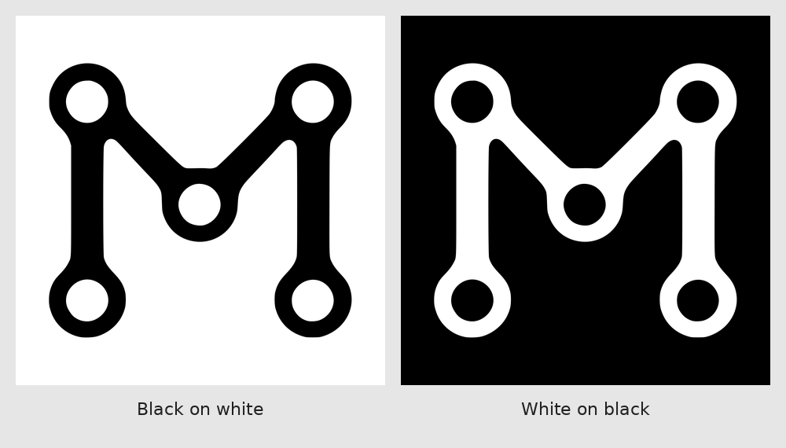

# MixOS brand art

The official MixOS mark: a rounded-flange "M" of five linked nodes. This is
the one source for the logo and favicons. The website, the desktop and the
installer image take their copies from here and never keep a second original.

**Status: preliminary designs.** Licensed like the code, MIT OR Apache-2.0
(the repo-wide `REUSE.toml` default). They were made with an AI image tool
to Mark Constable's instructions.



## Files

| Path | What |
|---|---|
| `logos/mixos-black-transparent.svg` | black mark, transparent background and node holes |
| `logos/mixos-white-transparent.svg` | white mark, transparent background and node holes |
| `favicons/black-on-white/` | opaque square set: black mark on white |
| `favicons/white-on-black/` | opaque square set: white mark on black |
| `preview.png` | both treatments side by side |

The SVGs are real vector outlines (1024 × 1024 viewBox), not embedded
rasters. Each favicon folder is a complete alternative:

| File | Size |
|---|---|
| `favicon.svg` | opaque square vector |
| `favicon.ico` | 16, 32, 48, 64, 128 and 256 px frames |
| `favicon-{16,32,48,64,128,256}x….png` | browser favicons |
| `apple-touch-icon.png` | 180 × 180, opaque |
| `apple-touch-icon-{152x152,167x167}.png` | 152 and 167, opaque |
| `icon-512.png` | 512 × 512, opaque |

Apple touch icons have solid backgrounds and square canvases. Leave the
corner masking to the device. The set was checked for dimensions, opacity
and vector/raster consistency, but not on physical Apple devices.

## Using it on the desktop

`mix share/brand/install.mix --root /opt/mixos/share` installs the transparent
M as `dev.mixos-symbolic` in MixOS and hicolor. A fresh image gets the small theme
indexes needed for lookup; an existing hicolor index is preserved. MixOS resolves
the M directly even when that existing index omits symbolic apps. Include the share root in
`XDG_DATA_DIRS`. Scene-host tints the symbolic SVG with the foreground colour,
and the panel prefers it over legacy launcher icons.

Install [`share/icons`](../icons/README.md) alongside it for the bundled
Material Symbols used by panel controls and core application entries.

## Using it on a website

Copy one favicon folder into the site's public root and add, inside `<head>`:

```html
<link rel="icon" href="/favicon.ico" sizes="any">
<link rel="icon" href="/favicon.svg" type="image/svg+xml">
<link rel="icon" href="/favicon-32x32.png" type="image/png" sizes="32x32">
<link rel="apple-touch-icon" sizes="180x180" href="/apple-touch-icon.png">
<link rel="apple-touch-icon" sizes="167x167" href="/apple-touch-icon-167x167.png">
<link rel="apple-touch-icon" sizes="152x152" href="/apple-touch-icon-152x152.png">
```

Adjust the paths for a subfolder. Apple's PNG Web Clip sizes are documented in
[Configuring Web Applications](https://developer.apple.com/library/archive/documentation/AppleApplications/Reference/SafariWebContent/ConfiguringWebApplications/ConfiguringWebApplications.html).

mixos.dev does not use this set yet: `docs/web/favicon.svg` is the older
gradient mark. Wiring `docs/build/gen-site.mix` to copy from here is pending.
